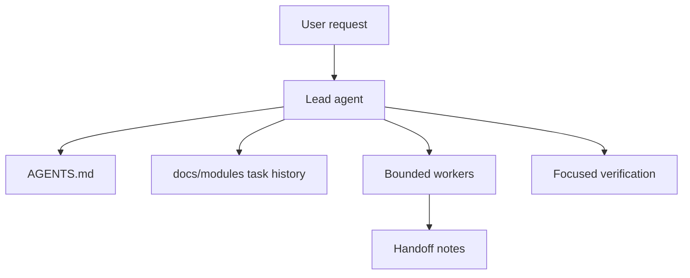
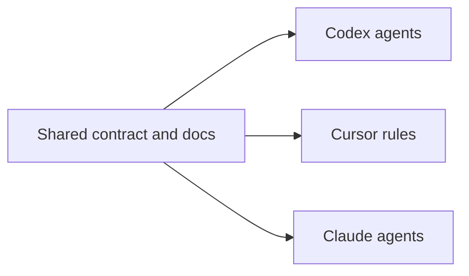

# Architecture

This repository is a documentation-first agent-team template. It provides the operating contract, platform adapters, workflow playbooks, templates, and module task history needed to run Agent AI coding work without a custom runtime.

## System Shape

## Primary Components

- `AGENTS.md`: shared operating contract for every agent.
- `docs/modules/`: module ownership, rules, decisions, and task history.
- `docs/agent-ai-task-flow.md`: end-to-end task flow.
- `docs/harness-coding-agent-flow.md`: harness layer for resumable work, executable feedback loops, evaluator roles, and entropy control.
- `docs/codex-flow-audit.md`: Codex-specific alignment notes.
- `prompts/`: paste-ready prompts for lead and worker sessions.
- `workflows/`: playbooks for common task types.
- `templates/`: repeatable task, handoff, review, and implementation-plan formats.
- `.codex/agents/`: Codex project agents for explicit `leader`, `coder`, and `reviewer` delegation.
- `.cursor/rules/`: Cursor adapter that points back to the shared contract.
- `.claude/agents/`: Claude Code adapter that points back to the shared contract.

## Adapter Boundary

The shared contract is the source of truth. Platform adapters should stay thin and avoid duplicating the full workflow.

## Module History

The module history store is intentionally small. Start with `docs/modules/README.md`, then read the target module folder before making targeted changes. Append one short `history.md` entry after meaningful work.

## Verification

Run focused checks for the changed surface. For documentation and workflow changes, verify file references, required metadata, and local links.
