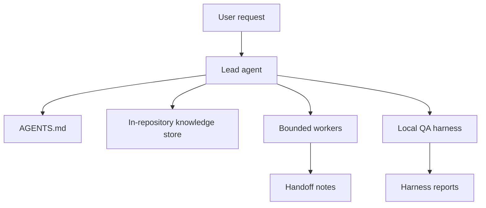
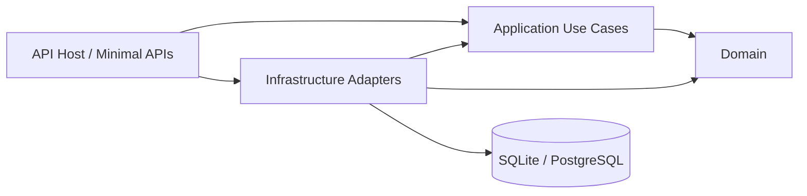

# Architecture

This repository is a documentation-first agent-team template. It provides the operating contract, role prompts, workflow playbooks, templates, examples, and a local harness for validating the repository knowledge store.

## System Shape



## Primary Components

- `AGENTS.md`: shared operating contract for every agent.
- `docs/`: repository knowledge store for product, design, execution plans, generated references, and quality standards.
- `prompts/`: paste-ready prompts for lead and worker sessions.
- `workflows/`: playbooks for common task types.
- `templates/`: repeatable task, handoff, review, and implementation-plan formats.
- `scripts/`: local automation, including the agent harness.
- `src/AgentTeams.SampleApi`: API host and Minimal API inbound adapters used by the harness.
- `src/AgentTeams.SampleApi.Domain`: domain entities and business rules with no ASP.NET or EF Core references.
- `src/AgentTeams.SampleApi.Application`: employee use cases, DTOs, result types, and ports.
- `src/AgentTeams.SampleApi.Infrastructure`: EF Core persistence adapters, SQLite/PostgreSQL provider wiring, and migrations.
- `src/AgentTeams.SampleApi.Tests`: API integration tests and application use-case tests.

## Clean Architecture Boundary



Dependency direction:

- API depends on Application for use-case contracts and Infrastructure for composition.
- Application depends on Domain and port interfaces only.
- Infrastructure implements Application ports and owns EF Core details.
- Domain has no framework, database, or transport dependencies.

## Knowledge Store

The knowledge store is intentionally kept in the repository so agents can ground decisions in checked-in context. Start with `docs/PLANS.md` for active work, `docs/PRODUCT_SENSE.md` for product direction, and `docs/QUALITY_SCORE.md` for evaluation criteria.

## Verification

Run:

```powershell
powershell -NoProfile -ExecutionPolicy Bypass -File scripts\Invoke-AgentHarness.ps1 -Mode Full -RunSampleApi
```
